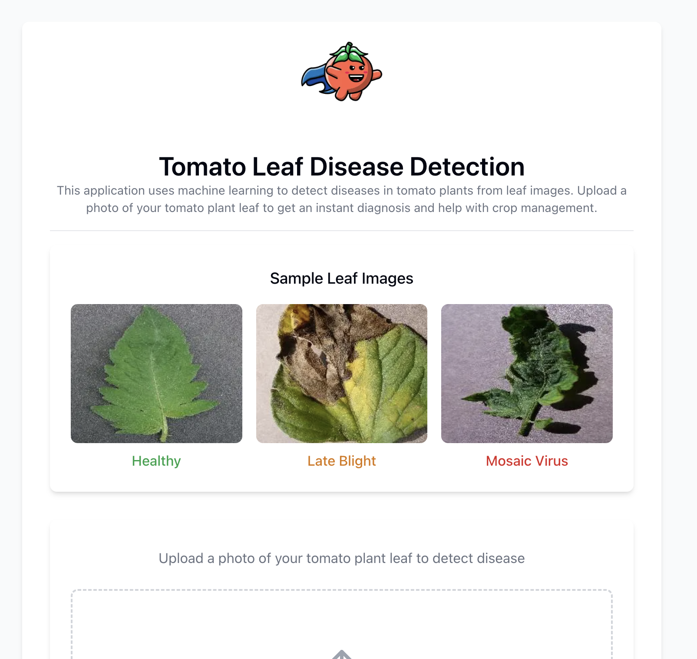

# 🍅 Tomato Disease Detection



## The Story Behind the Solution

Every year, tomato farmers worldwide lose billions in crop yield due to various plant diseases. Early detection is crucial, but traditional methods often require expert knowledge and can be time-consuming. What if technology could empower farmers to identify diseases instantly, regardless of their expertise level?

**Tomato Disease Detection** was born from this challenge. Using the power of deep learning and computer vision, I have created an easy-to-use tool that can identify common tomato diseases from a simple photograph, helping farmers take immediate action to protect their crops.

## What It Does

This application uses a trained convolutional neural network to identify five common tomato plant conditions:

- Bacterial spot
- Early blight
- Late blight
- Mosaic virus
- Healthy plants

Simply upload an image of your tomato plant leaf, and within seconds you'll receive an accurate diagnosis with confidence score.


## 🚀 Getting Started

### Prerequisites

- Python 3.12+
- Node.js 20+
- NPM or Yarn

### Backend Setup

1. Navigate to the backend directory:

   ```
   cd backend
   ```

2. Install dependencies:
   ```
   uv sync
   ```
3. Start the FastAPI server:
   ```
   uv run main.py
   ```

The backend will be running at `http://localhost:8001`

### Frontend Setup

1. Navigate to the frontend directory:

   ```
   cd frontend
   ```

2. Install dependencies:
   ```
   npm install
   ```
3. Start the development server:
   ```
   npm run dev
   ```

The frontend will be available at `http://localhost:3000`

## 🧠 Model Training

The model was trained on a 7000 images dataset across different tomato disease categories using `tensorflow v2.19`. The dataset includes various lighting conditions, angles, and disease progression stages to ensure the model works in real-world conditions.

The training process and model development can be found in `training/training.ipynb`.

## 📊 Technical Details

- **Backend**: FastAPI
- **Frontend**: Next.js with TypeScript
- **AI Model**: CNN built with TensorFlow/Keras
- **Dataset**: Plant Village dataset with augmentations. The dataset was originally sourced from [Kaggle Plant Village Dataset](https://www.kaggle.com/datasets/emmarex/plantdisease)

## 🌱 Future Enhancements

- Additional crop disease detection
- Mobile app for offline usage
- Treatment recommendations based on detected diseases
- Integration with weather data to provide preventive advice

## 📝 License

This project is open-source and available under the MIT License.

## 📬 Contact

Have questions, suggestions, or want to contribute? I'd love to hear from you!

- **Email**: shashanksrajak@gmail.com
- **Website**: [shashankrajak.in](https://shashankrajak.in)
- **Project Website**: [Project Webpage](https://shashankrajak.in/projects/tomato-disease-detection)

Feel free to open an issue or submit a pull request if you have ideas for improvements or have found a bug.

---

_Helping farmers grow healthier crops, one image at a time._ 🌿
